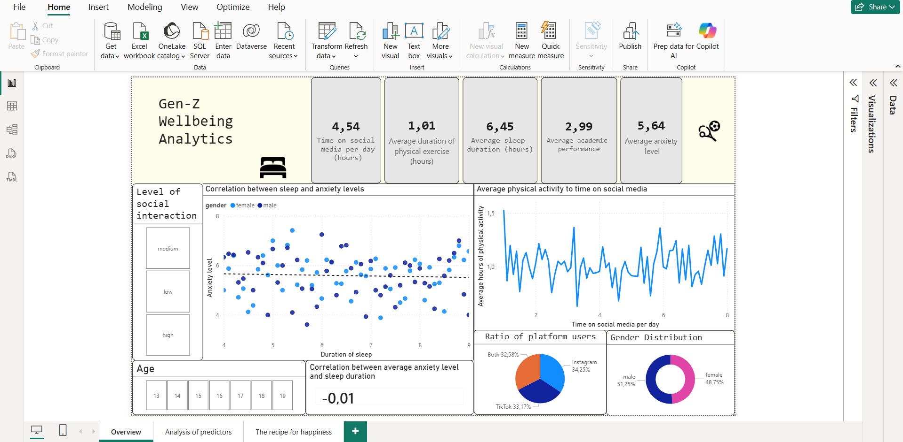
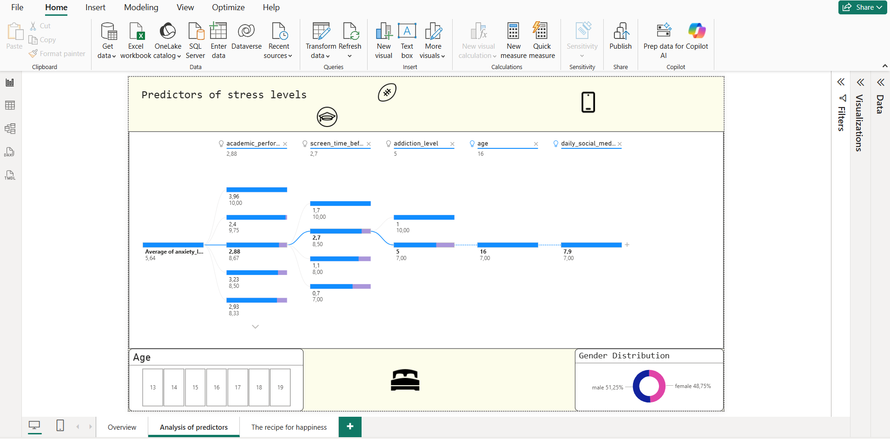
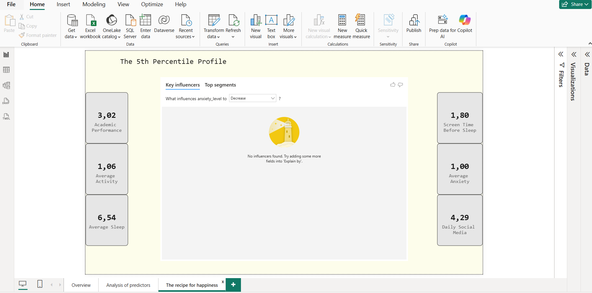

# BI-analysis
Data analysis and visualization using Power BI: Evaluating the impact of daily lifestyle factors on Gen-Z life satisfaction and mental resilience

# BI-analysis: Gen-Z Wellbeing & Resilience Patterns

## 🎯 Project Goal
This project focuses on identifying the "Recipe for Happiness" among Gen-Z by analyzing a dataset of mental health and daily habits. The core objective was to use advanced data modeling to isolate the habits of the most resilient individuals.

## 🚀 Key Technical Features
* **Advanced DAX Modeling:** Implemented `PERCENTILEX.INC` and `CALCULATE` logic to create a **5th Percentile Profile**, isolating the top 5% of individuals with the lowest anxiety levels.
* **Predictive Analysis:** Used AI-driven *Key Influencers* visuals to test hypothesis-driven correlations between sleep, screen time, and mental wellbeing.
* **Professional UI/UX:** Developed a high-contrast, streamlined dashboard design focused on readability and data-driven storytelling.

## 📊 Dashboard Structure
1.  **Overview:** General statistics and demographic distribution.
2.  **Analysis of Predictors:** Correlation analysis between sleep duration, social media usage, and anxiety.
3.  **The 5th Percentile Profile:** A deep dive into the lifestyle of the most resilient group (Average sleep, academic performance, and addiction levels).

## 💡 Key Finding
One of the most profound insights was the "Empty Influencer" result for the top-tier group: even for the most resilient individuals, there is no single "magic bullet" factor. Wellbeing is a holistic balance of multiple daily choices.

## 📊 Project Visuals

### Overview

### Predictors Analysis

### The 5th Percentile Profile (Happiness Recipe)

## 📂 Data Source
The dataset used in this analysis is sourced from open data repositories: https://www.kaggle.com/datasets/algozee/teenager-menthal-healy

⚙️ Data Transformation & Logic
To ensure a clear distinction between raw data and calculated insights, the project is structured as follows:

Calculated Metrics (DAX): Used for dynamic analysis, such as the 5th percentile resilience threshold and anxiety-to-sleep correlation ratios.

Data Cleaning: Handled within Power Query to ensure consistent formatting for age groups and lifestyle metrics.

Categorization: Raw numerical values were grouped into logical segments (e.g., Social Interaction levels) to enhance visual storytelling.

---
*Developed as part of a personal data science portfolio.*
